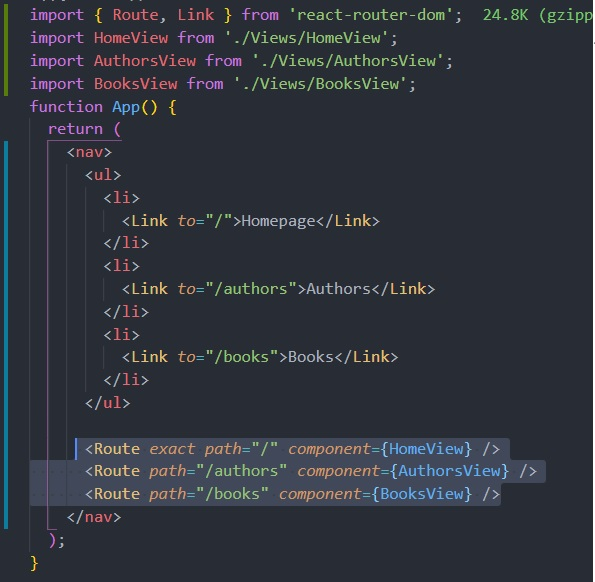
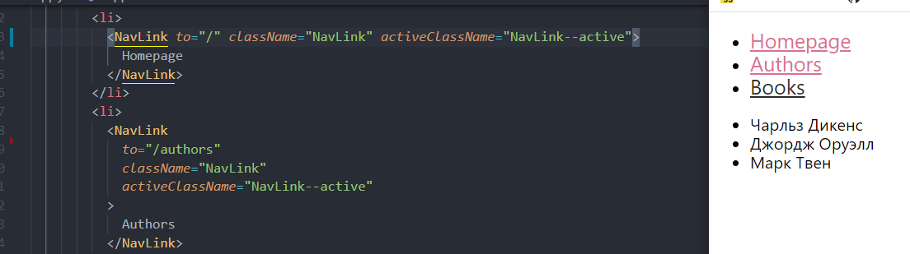
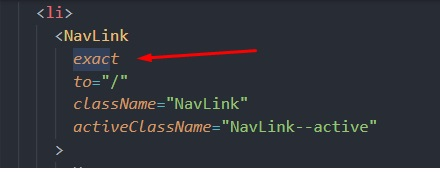
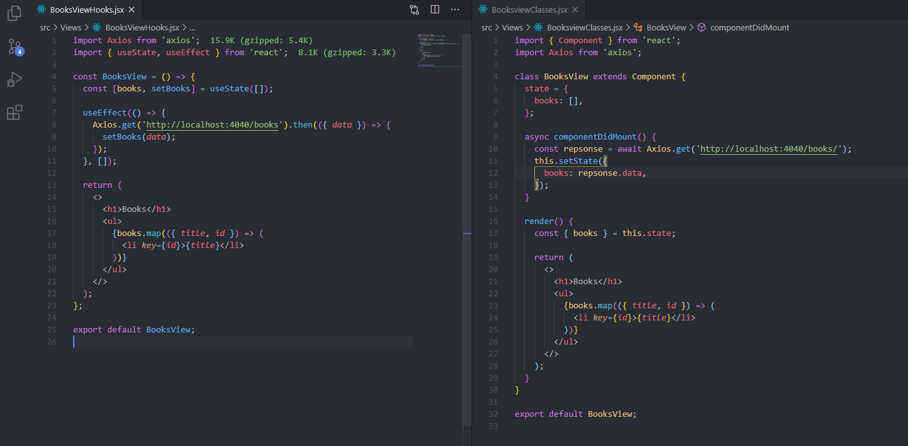
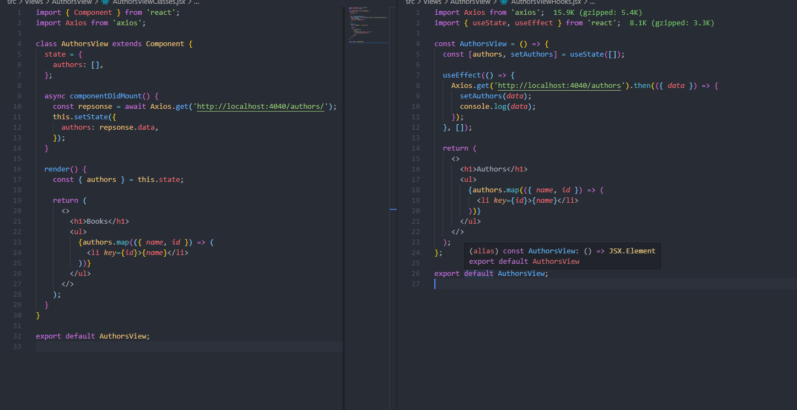
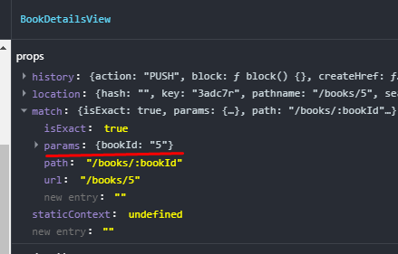
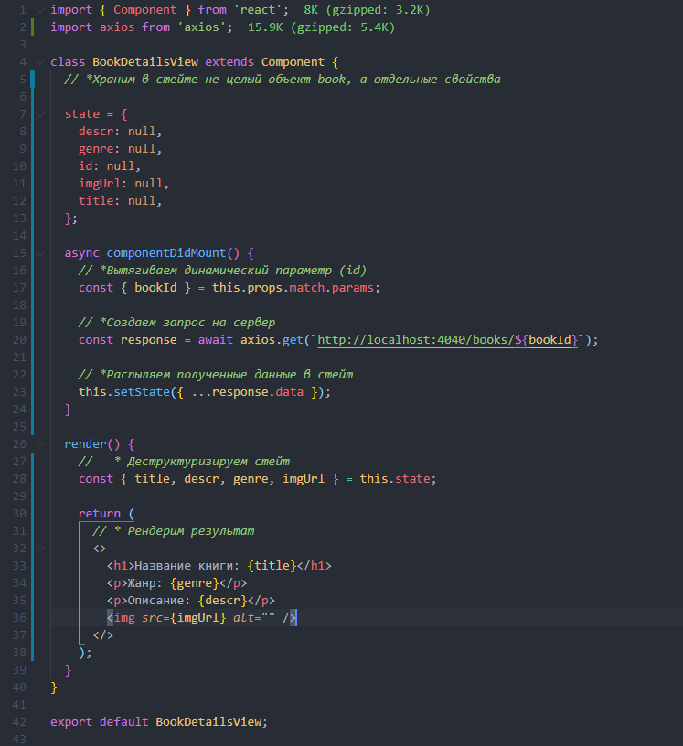

# Инструкция по работе с React Router

## Содержание:

[Начало](#start)

[Создание навигации](#createnavigation)

[Компонент NavLink](#navlink)

[Компонент Switch](#switch)

[Workshop: практика](#workshop)

[Создаем вложенную навигацию динамически](#layerednavigation)

[Дополнительные пропсы: нistory, location, match](#additionalprops) -

[Cоздание вложенного компонента и варианты размещения в `<Route/>`](#component__bookdetailsviews) -

[Хранение динамических параметров](#storage_dynamic_parameters) -

[Создание http-запроса для получения данных для рендера одной книги](#add_state_and_request_to_render_one_book)

[Создание вложенного маршрута](#nestedroute)

---

### Start

1. Установить пакет
   [react-router-dom](https://reactrouter.com/web/guides/quick-start)
2. В корневом index.js сделать import{BrowserRouter} from 'react-router-dom' и
   обернуть компонент App в BrowserRouter:

   ```
   <BrowserRouter>
   <App />
   </BrowserRouter>
   ```

3. Создать в папке src папку views для компонентов-страниц, которые будут
   рендериться

4. В App сделать `import {Route} from 'react-router-dom'`, прописать этот
   компонент в App и задать ему несколько пропов:

   - path - принимает путь к странице
   - component - принимает компонент, который надо зарендерить

   - exact - булевый проп, передается без значения (по умолчанию - **true**) для
     рендеринга только при точном совпадении, позволяет избежать одновременного
     рендера 2-х и более страниц, которые начинаются на одни и те же символы.
     Например '/' '/product', '/products'

#### Example

1. Создаем компонент домашней страницы HomeView.
2. Делаем import в App.
3. Пишем в App `<Route path="/" component={HomeView}` />
   `<Route path="/newpage" component={NewPage} `/>

---

### CreateNavigation

**Навигация делается не как ссылки на страницы в теге `<a/>`,** т.к. при клике
на ссылку происходит перезагрузка страницы. Для создания навигации без
перезагрузки страницы нужно **просто изменить URL в адресной строке.** Для
этого:

1. Делаем в App `import {Link} from 'react-router-dom'` - аналог тега `<a>` с
   расширенным функционалом (изменяет url при клике без перезагрузки)
2. Добавляем компонент `<Link/>`в App с пропсами:
   - to - значение - строка адреса, куда надо перенаправить (относительно корня)

_При рендере в DOM `<Link/>` преобразовывается в `<a/>` и получается валидный
html-элемент_

Пример:



---

### NavLink

Для добавления стилизации вместо {Link} можно использовать компонент {NavLink},
у которого есть доп. пропы:

1. `style={основные стили}`
2. `activeStyle={стили в активном состоянии}`

Так как мы **НЕ** используем инлайн-стили, то меняем _~~style~~_ на
**_className_**, а _~~activeStyle~~_ на **activeClassName**.

В итоге получаем:

```
         <NavLink to="/" className="NavLink" activeClassName="NavLink__active">
            Homepage
         </NavLink>
```

При передаче activeClassName на несколько страниц сразу стили автоматически не
переключаются при клике на др. компонент, он становится активным в придачу к
изначально активному компоненту, так как они имеют общий корень - **`/`**, а
сравнение идет по принципу _"начинается на..."_

---



---

Избежать этого помогает добавление булевого пропа **`exact`**. В этом случае
**`activeClassName`** применится только к той ссылке, у которой значение пропа
**`to === path`**

---



---

### Switch

**Если в навигации нет адреса, введенного в url-строку, ничего не
зарендерится.** Для обработки запросов по несуществующему адресу:

1. Создаем компонент NotFoundView для обработки запросов по несуществующим
   адресам
2. Добавляем в App {Route component={NotFoundView}}
3. Проп path не указан, поэтому NotFoundView рендерится всегда. Чтобы это
   поправить, нужен компонент Switch из react-router-dom

   `import { Switch } from 'react-router-dom'`

4. Оборачиваем в него группу `<Route/>`.

```
      <Switch>
        <Route exact path="/" component={HomeView} />
        <Route path="/authors" component={AuthorsView} />
        <Route path="/books" component={BooksView} />
        <Route component={NotFoundViews} />
      </Switch>
```


`{Switch}` проходится по группе `<Route/>` до 1-го совпадения, игнорируя
остальные. Так как компонент `{NotFoundViews}` записан в последний `<Route/>`,
**он выполнится только в том случае, если не выполнится ни один из предыдущих,
т.е. тогда, когда поступит запрос на несуществующий адрес**.

---

### Workshop

1. Используем [Json Server](https://www.npmjs.com/package/json-server) для
   имитации бекенда.

   - В объекте scripts файла package.json
   - прописать`"api-server": "json-server --delay 300 --port 4040 --watch db.json"`
   - создать `db.json` в корне проекта.

- запусить json-server командой `npm run api-server`

2. Добавляем данные в `db.json`
   [из репозитория Репеты](https://github.com/luxplanjay/react-18/blob/07-react-router/db.json).
3. Создаем компонент BooksView со стейтом
4. Получаем список объектов книг через then или axios
5. Выводим заголовки книг



Проделываем то же самое для компонента AuthorsView, только меняем названия с
Books на Authors, а с сервера извлекаем не `{title}`, а `{name }`



#### LayeredNavigation

**Задача**: _при переходе на BooksView должна рендериться галерея книг, а при
клике на конкретную страницу должен быть переход на отдельную страницу_

1. Добавляем `import { Link } from 'react-router-dom'` в компонент
2. Задаем маршрут при помощи динамического параметра `?`:

```
{books.map(({ title, id }) => (
          <Link to={`books./${id}`}>{title}</Link>
        ))} - плохой вариант

```

#### AdditionalProps

Чтобы не страдать "антипаттерном" магических строк, не стоит использовать такую
заись при передаче пути. Для таких задач есть дополнительные пропсы, по
умолчанию имеющиеся у компонента, который был зарендерен через `<Route/>`:

1. `нistory` - для работы с историей;
2. `location` -описывает текущий путь в адресной строкe;
3. `match` - отслеживает совпадение текущего маршрута и url

Сейчас нам интересен проп `match`. У него есть такие свойства:

- `isExast` - возвращает `true` при совпадении маршрута и `false` при
  несовпадении.
- `path` - шаблон, на который зарендерился текущий Route. Используется для
  создания вложенной навигации.
- `url` - то, что написано в адресной строке. Используется для создания
  вложенных маршрутов

```
{books.map(({ title, id }) => (
              <Link to={`${this.props.match.url}/${id}`}>{title}</Link>
        ))} - хороший вариант
```

#### Component\_\_BookDetailsViews

1. Создадим компонент `BookDetailsView`, который будет рендериться на
   обозначенный `url` `(this.props.match.url)`
2. Добавим в группу Route в App этот компонент
   `<Route path='books/:bookId' component={BookDatailsView}/>`, где `books/` -
   статическая часть url, а `:bookId` подставляется динамически в зависимости от
   выбранной книги.

_Есть несколько способов сделать так, чтобы при клике на `</Link>` рендерилась
страница одной книги_:

##### Вариант 1 - использовать особенность компонента Switch (поиск до 1-го совпадения)

Разместить в `<Switch/>` сначала
`<Route path='/books/:bookId' component={BookDatailsView}/>` затем
`<Route path="/books" component={BooksView} />`

##### Вариант 2 - использовать проп exact для рендера только при точном сопадении

Добавить `exact` на `<Route path="/books" component={BooksView} />`

### Storage_Dynamic_Parameters

После добавления страницы `{BookDatailsView}` в `this.props.match` появился
параметр `params`, хранящий объект с ключем и значением динамического параметра
свойство params, хранящее объект с динамическим параметром (`id`)



Используем это, чтобы "достучаться" до `id` книги и запишем в компоненте
`BookDatailsView`

`return <h1>Страница одной книги {this.props.match.params.bookId}</h1>;`

### Add_State_And_Request_To_Render_One_Book

Поскольку компонент `BookDatailsView` не вложен в `BooksView`, для получения
данных для рендеринга 1-й книги нужно сделать отдельный стейт

```
  state = {
    descr: null,
    genre: null,
    id: null,
    imgUrl: null,
  };
```

и http-запрос
`const response = await axios.get('http://localhost:4040/books/${bookId}')`;

Рабочий компонент выглядит так: 

### NestedRoute - вложенная маршрутизация
