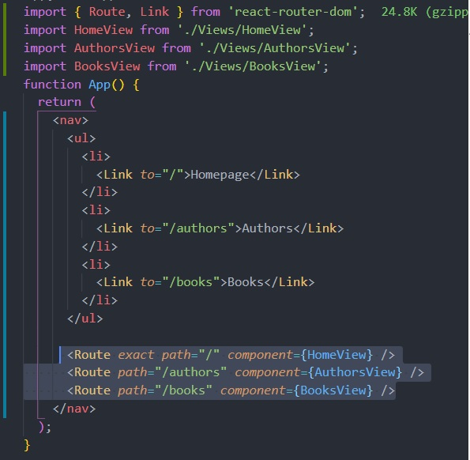

# Инструкция по работе с React Router

1. Установить пакет react-router-dom
2. В корневом index.js сделать import{BrowserRouter} from 'react-router-dom' и
   обернуть компонент App в BrowserRouter:

<BrowserRouter>
  <App />
</BrowserRouter>

3. Создать в папке src папку views для компонентов-страниц, которые будут
   рендериться

4. В App сделать import {Route} from 'react-router-dom', прописать этот
   компонент в App и задать ему несколько пропов:

   - path - принимает путь к странице
   - component - принимает путь к странице, кот. надо зарендерить

   - exact - булевый проп, передается без значения (true) для рендеринга только
     при точном совпадении, позволяет избежать одновременного рендера 2-х и
     более страниц, которые начинаются на одни и те же символы. Например '/'
     '/product', '/products'

## Пример

1. Создаем компонент домашней страницы HomeView
2. Делаем import в App
3. Пишем в App <Route path="/" component={HomeView} />
   <Route path="/newpage" component={NewPage} />

## Создание навигации для перехода по страницам

**Навигация делается не как ссылки на страницы,** т.к. при клике на ссылку
происходит перезагрузка страницы. Для создания навигации без перезагрузки
страницы нужно **изменить URL в адресной строке** Для этого:

1. Делаем в App import {Link} from 'react-router-dom' - аналог тега а с
   расширенным функционалом (изменяет url при клике без перезагрузки)
2. Добавляем компонент <Link/> в App и добавляем пропсы:
   - to - значение - строка адреса, куда надо перенаправить (относительно корня)

Пример:

