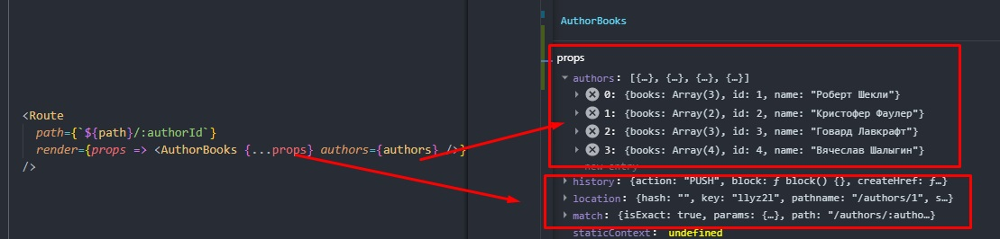
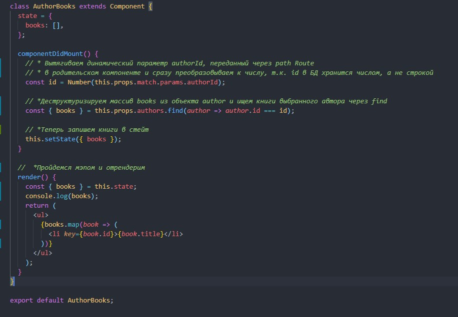

# Инструкция по работе с React Router

## Содержание:

[Начало](#start)

[Создание навигации](#createnavigation)

[Компонент NavLink](#navlink)

[Компонент Switch](#switch)

## [Workshop: практика](#workshop)

[Создаем вложенную навигацию динамически](#layerednavigation)

[Дополнительные пропсы: нistory, location, match](#additionalprops)

[Cоздание вложенного компонента и варианты размещения в `<Route/>`](#componentbookdetailsviews)

[Хранение динамических параметров](#storage_dynamic_parameters)

[Создание http-запроса для получения данных для рендера одной книги](#add_state_and_request_to_render_one_book)

[Создание вложенного маршрута](#nestedroute)

[Рефакторинг кода с вложенной динамической маршрутизацией](#refactoring)

## [Код с занятия](#allcode)

[Код компонента BooksViewClasses](#booksviewclasses)

[Код компонента AuthorsVies](#authorsview)

[Код компонента AuthorBooks](#authorbooks)

[Код компонента App](#app)

---

## [LazyLoad - ленивая загрузка компонентов](#lazyload)

### Start

1. Установить пакет
   [react-router-dom](https://reactrouter.com/web/guides/quick-start)
   `npm install react-router-dom`

2. В корневом `index.js` сделать `import{BrowserRouter} from 'react-router-dom'`
   и обернуть компонент `App` в `BrowserRouter`:

   ```
   <BrowserRouter>
   <App />
   </BrowserRouter>
   ```

3. Создать в папке src папку views для компонентов-страниц, которые будут
   рендериться

4. В App сделать `import {Route} from 'react-router-dom'`, прописать этот
   компонент в App и задать ему несколько пропов:

   - path - принимает путь к странице
   - component - принимает компонент, который надо зарендерить

   - exact - булевый проп, передается без значения (по умолчанию - **true**) для
     рендеринга только при точном совпадении, позволяет избежать одновременного
     рендера 2-х и более страниц, которые начинаются на одни и те же символы.
     Например `'/'` '/product', '/products'

#### Example

1. Создаем компонент домашней страницы HomeView.
2. Делаем import в App.
3. Пишем в App `<Route path="/" component={HomeView}` />
   `<Route path="/newpage" component={NewPage} `/>

---

### CreateNavigation

**Навигация делается не как ссылки на страницы в теге `<a/>`,** т.к. при клике
на ссылку отправляется get-запрос и происходит перезагрузка страницы. Для
создания навигации без перезагрузки страницы:

1. Делаем в App `import {Link} from 'react-router-dom'` - аналог тега `<a>` с
   расширенным функционалом (изменяет url при клике без перезагрузки)
2. Добавляем компонент `<Link/>`в App с пропом `to`, значением которого может
   быть:
   - строка адреса, куда надо перенаправить (относительно корня),
   - объект location с необязательными свойствами pathname, search, hach, state.

Пример:


---

_При рендере в DOM `<Link/>` преобразовывается в `<a/>` и получается валидный
html-элемент_

### NavLink

Для добавления стилизации вместо {Link} можно использовать компонент {NavLink},
у которого есть доп. пропы:

1. `style={основные стили}`
2. `activeStyle={стили в активном состоянии}`

Так как мы **НЕ** используем инлайн-стили, то меняем _~~style~~_ на
**_className_**, а _~~activeStyle~~_ на **activeClassName**.

В итоге получаем:

```
         <NavLink to="/" className="NavLink" activeClassName="NavLink__active">
            Homepage
         </NavLink>
```

```
`css`
.NavLink {
  font-size: 20px;
  color: #2a2a2a;
}

.NavLink--active {
  color: palevioletred;
}

```

При передаче activeClassName на несколько страниц сразу стили автоматически не
переключаются при клике на др. компонент, он становится активным в придачу к
изначально активному компоненту, так как они имеют общий корень - **`/`**, а
сравнение идет по принципу _"начинается на..."_

---


---

Избежать этого помогает добавление булевого пропа **`exact`**. В этом случае
**`activeClassName`** применится только к той ссылке, у которой значение пропа
**`to === path`**

---


---

### Switch

**Если в навигации нет адреса, введенного в url-строку, ничего не
зарендерится.** Для обработки запросов по несуществующему адресу:

1. Создаем компонент NotFoundView с сообщением, которое будет выводиться при
   запросе по несуществующим адресам
2. Добавляем в App `<Route component={NotFoundViews} />`
3. Проп `path` не указан, поэтому `NotFoundView` рендерится всегда. Чтобы это
   поправить, нужен компонент `Switch` из react-router-dom

   `import { Switch } from 'react-router-dom'`

4. Оборачиваем в него группу `<Route/>`.

```
      <Switch>
        <Route exact path="/" component={HomeView} />
        <Route path="/authors" component={AuthorsView} />
        <Route path="/books" component={BooksView} />
        <Route component={NotFoundViews} />
      </Switch>
```


`{Switch}` работает по принципу ветвления `if` `else`, он проходится по группе
`<Route/>` до 1-го совпадения, игнорируя остальные. Так как компонент
`{NotFoundViews}` записан в последний `<Route/>`, **он выполнится только в том
случае, если не выполнится ни один из предыдущих, т.е. тогда, когда поступит
запрос на несуществующий адрес**.

---

### Workshop

1. Используем [Json Server](https://www.npmjs.com/package/json-server) для
   имитации бекенда.

   - В объекте scripts файла package.json
     прописать`"api-server": "json-server --delay 300 --port 4040 --watch db.json"`
   - создать `db.json` в корне проекта.
   - запусить json-server командой `npm run api-server`

2. Добавляем данные в `db.json`
   [из репозитория Репеты](https://github.com/luxplanjay/react-18/blob/07-react-router/db.json).
3. Создаем компонент BooksView со стейтом
4. Получаем список объектов книг через fetch или axios
5. Выводим заголовки книг


Проделываем то же самое для компонента AuthorsView, только меняем названия с
Books на Authors, а с сервера извлекаем не `{title}`, а `{name }`


#### LayeredNavigation

##### Создаем вложенную навигацию динамически

**Задача**: _при переходе на BooksView должна рендериться галерея книг, а при
клике на конкретную страницу должен быть переход на отдельную страницу_

1. Добавляем `import { Link } from 'react-router-dom'` в компонент
2. Задаем маршрут при помощи динамического параметра `?`:

```
{books.map(({ title, id }) => (
          <Link to={`books./${id}`}>{title}</Link>
        ))} - плохой вариант

```

#### AdditionalProps

##### Дополнительные пропсы: нistory, location, match

Чтобы не страдать антипаттерном "магических строк", не стоит использовать такую
запись при передаче пути. Для таких задач есть дополнительные пропсы, по
умолчанию имеющиеся у компонента, который был зарендерен через `<Route/>`:

1. `нistory` - для работы с историей;
2. `location` -описывает текущий путь в адресной строкe;
3. `match` - отслеживает совпадение текущего маршрута и url.

Сейчас нам интересен проп `match`. У него есть такие свойства:

- `isExast` - возвращает `true` при совпадении маршрута и `false` при
  несовпадении.
- `path` - шаблон, на который зарендерился текущий Route. Используется для
  создания вложенных маршрутов.
- `url` - то, что написано в адресной строке. Используется для создания
  вложенной навигации

```
{books.map(({ title, id }) => (
              <Link to={`${this.props.match.url}/${id}`}>{title}</Link>
        ))} - хороший вариант
```

#### ComponentBookDetailsViews

##### Cоздание вложенного компонента и варианты размещения в `<Route/>`

1. Создадим компонент `BookDetailsView`, который будет рендериться на
   обозначенный `url` `(this.props.match.url)`
2. Добавим в группу Route в App этот компонент
   `<Route path='books/:bookId' component={BookDatailsView}/>`, где `books/` -
   статическая часть url, а `:bookId` подставляется динамически в зависимости от
   выбранной книги.

_Есть несколько способов сделать так, чтобы при клике на `</Link>` рендерилась
страница одной книги_:

##### Вариант 1 - использовать особенность компонента Switch (поиск до 1-го совпадения)

Разместить в `<Switch/>` сначала
`<Route path='/books/:bookId' component={BookDatailsView}/>` затем
`<Route path="/books" component={BooksView} />`

##### Вариант 2 - использовать проп exact для рендера только при точном сопадении

Добавить `exact` на `<Route path="/books" component={BooksView} />`

### Storage_Dynamic_Parameters

##### Хранение динамических параметров

После добавления страницы `{BookDetailsView}` в `this.props.match` появился
параметр `params`, хранящий объект с динамическим параметром (`id`)


Используем это, чтобы "достучаться" до `id` книги и запишем в компоненте
`BookDetailsView`

`return <h1>Страница одной книги {this.props.match.params.bookId}</h1>;`

### Add_State_And_Request_To_Render_One_Book

##### Создание http-запроса для получения данных для рендера одной книги

Поскольку компонент `BookDetailsView` не вложен в `BooksView`, для получения
данных для рендеринга 1-й книги нужно сделать отдельный стейт

```
  state = {
    descr: null,
    genre: null,
    id: null,
    imgUrl: null,
  };
```

и http-запрос
`const response = await axios.get('http://localhost:4040/books/${bookId}')`;

Рабочий компонент выглядит так:


### NestedRoute

##### Создание вложенного маршрута

**Задача**: при клике на имя автора должен рендериться список его книг, но не на
отдельной странице, а под списком автором.

Для решения нужно

1. создать динамический маршрут в компоненте AuthorsView

```
 render() {
    const { authors } = this.state;
    const { url } = this.props.match;


    return (
      <>
        <h1>Books</h1>
        <ul>
          {authors.map(({ name, id }) => (
            <li key={id}>
              <NavLink to={`${url}/${id}`}>{name}</NavLink>
            </li>
          ))}
        </ul>
      </>
    );
  }
```

2. добавить в папку `Components` компонент `AuthorBooks`,

3. поставить в адрес GET-запроса `http://localhost:4040/authors?_embed=books`
   вместо ~~http://localhost:4040/authors~~, чтобы сразу получать книги, и
   передавать их пропсом в компонент `AuthorBooks`. Альтернатива - делать еще 1
   get-запрос

4. добавить `Route` в компонент `AuthorsView` после `<ul>`, чтобы он рендерил
   дополнительный кусок интерфейса из `AuthorBooks`. Используем здесь метод
   render, чтобы передать несколько пропсов

---

      <Route
          path={`${path}/:authorId`}
          render={props => {
            return <AuthorBooks {...props} authors={authors} />;
          }}
        />

---

---

      `render` — функция-проп для `Route`, которая должна вернуть элемент React. Будет
      вызвана когда удовлетворится сопоставление в path. Render довольно похож на
      component, но используется для inline рендеринга и подстановки необходимых для
      элемента props. Если передать в `render` каллбек-функцию, перерендерится только
      измененный элемент, а если ее передать в проп `component`, произойдет
      размонтирование и перерендеринг всего компонента.

---

В параметр `props` метода `render` приходят дефолтные пропсы, которые есть на
Route: `нistory`, `location`, `match`. Мы их распыляем, чтобы далее использовать
в компоненте `AuthorsBooks`.



Теперь пропы доступны в `AuthorBooks` и можно получить нужные данные:

- `this.props.match.params.authorId` - динамический параметр (`id`),
- `this.props.authors` - массив авторов

<!-- При клике на `<Link>` в компонент `AuthorsBooks` приходят новые пропсы. При этом
компонент `AuthorsView` не размонтируется, а `AuthorsBooks` рендерится как
дополнительный контент внутри него. -->

В `ComponentDidMount()` получаем массив книга выбранного автора, используя метод
`find`, и сохраняем их в `state`. Делаем это все в методе `ComponentDidMount`

```
  componentDidMount() {
    const id = Number(this.props.match.params.authorId);
    const { books } = this.props.authors.find(author => author.id === id);
    this.setState({ books });
  }
```

---

Рабочий компонент выглядит так: 

---

### Refactoring

##### Рефакторинг кода с вложенной динамической маршрутизацией

Проблема вышеприведенного решения в том, что компонент `AuthorBooks` принимает
слишком много данных, а нам нужно сделать его максимально "плоским". Поэтому
перенесем логику в родительский компонент `AuthorsView`, а именно в `Route`

```
<Route
          path={`${path}/:authorId`}
          render={props => {
            const bookId = Number(props.match.params.authorId);
             const author = this.state.authors.find(({ id }) => id === bookId);

            console.log(author);
            return <AuthorBooks {...props} authors={authors} />;
          }}
        />


```

В переменной author хранится объект, у которого есть свойство books - массив
книг, но на первом рендере, пока мы не выбрали автора на странице, массив
остается пустым, в стейт еще ничего не записано.

**Чтобы не было ошибки, нужно рендерить Route по условию, только в том случае,
если длина массива authors > 0.**

`{this.state.authors.length > 0 && <Route/>}`

или в том случае, если массив `author` не пуст

`return author && <AuthorBooks {...props} books={author.books} />;`

В компонент `AuthorBooks` приходит один проп - `books` - массив с книгами.
Достаточно его получить и перебрать мэпом

```
  render() {
    const { books } = this.props;
    return (
      <ul>
        {books.map(book => (
          <li key={book.id}>{book.title}</li>
        ))}
      </ul>
    );
  }
```

В завершение сделаем внешнюю навигацию для перенаправления со страницы
`AuthorBooks` на `BooksDetailsView`. Для этого в компоненте `AuthorBooks`
добавим

```
`<Link to={`books/${book.id}`}>{book.title}</Link>`
```

## AllCode

#### AuthorBooks

```
import { Component } from 'react';
import { Link } from 'react-router-dom';

class AuthorBooks extends Component {
  render() {
    const { books } = this.props;
    return (
      <ul>
        {books.map(book => (
          <li key={book.id}>
            <Link to={`/books/${book.id}`}>{book.title}</Link>
          </li>
        ))}
      </ul>
    );
  }
}

export default AuthorBooks;
```

#### AuthorsView

```
import { Component } from 'react';
import Axios from 'axios';
import { NavLink, Route } from 'react-router-dom';

import AuthorBooks from '../../Components/AuthorBooks';

class AuthorsView extends Component {
  state = {
    authors: [],
  };

  async componentDidMount() {
    const repsonse = await Axios.get(
      'http://localhost:4040/authors?_embed=books',
    );
    this.setState({
      authors: repsonse.data,
    });
  }
  render() {
    const { authors } = this.state;
    const { url, path } = this.props.match;
    return (
      <>
        <h1>Books</h1>
        <ul>
          {authors.map(({ name, id }) => (
            <li key={id}>
              <NavLink to={`${url}/${id}`}>{name}</NavLink>
            </li>
          ))}
        </ul>

        <Route
          path={`${path}/:authorId`}
          render={props => {
            const bookId = Number(props.match.params.authorId);
            const author = this.state.authors.find(({ id }) => id === bookId);

            return author && <AuthorBooks {...props} books={author.books} />;
          }}
        />
      </>
    );
  }
}

export default AuthorsView;
```

#### BooksView

```
import { Component } from 'react';
import Axios from 'axios';
import { Link, Route } from 'react-router-dom';

class BooksView extends Component {
  state = {
    books: [],
  };

  async componentDidMount() {
    const repsonse = await Axios.get('http://localhost:4040/books/');
    this.setState({
      books: repsonse.data,
    });
  }

  render() {
    const { books } = this.state;

    return (
      <>
        <ul>
          {books.map(({ title, id }) => (
            <li key={id}>
              <Link to={`${this.props.match.url}/${id}`}>{title}</Link>
            </li>
          ))}
        </ul>
      </>
    );
  }
}

export default BooksView;

```

#### BookDetailsView

```
import { Component } from 'react';
import axios from 'axios';

class BookDetailsView extends Component {

  state = {
    descr: null,
    genre: null,
    id: null,
    imgUrl: null,
    title: null,
  };

  async componentDidMount() {
    const { bookId } = this.props.match.params;

    const response = await axios.get(`http://localhost:4040/books/${bookId}`);

    this.setState({ ...response.data });
  }

  render() {
    const { title, descr, genre, imgUrl } = this.state;

    return (
      <>
        <h1>Название книги: {title}</h1>
        <p>Жанр: {genre}</p>
        <p>Описание: {descr}</p>
        
      </>
    );
  }
}

export default BookDetailsView;

```

#### App

```
import { Route, NavLink, Switch } from 'react-router-dom';
import HomeView from './Views/HomeView';
import AuthorsView from './Views/AuthorsView/AuthorsViewClasses';
import BooksView from './Views/BooksView/BooksViewClasses';
import NotFoundViews from './Views/NotFoundView';
import BookDetailsView from './Views/BookDetailsView';

import './base.scss';

function App() {
  return (
    <nav>
      <ul>
        <li>
          <NavLink
            to="/"
            exact
            className="NavLink"
            activeClassName="NavLink--active"
          >
            Homepage
          </NavLink>
        </li>
        <li>
          <NavLink
            to="/authors"
            className="NavLink"
            activeClassName="NavLink--active"
          >
            Authors
          </NavLink>
        </li>
        <li>
          <NavLink
            to="/books"
            className="NavLink"
            activeClassName="NavLink--active"
          >
            Books
          </NavLink>
        </li>
      </ul>

      <Switch>
        <Route exact path="/" component={HomeView} />
        <Route path="/authors" component={AuthorsView} />
        <Route path="/books/:bookId" component={BookDetailsView} />
        <Route exact path="/books" component={BooksView} />

        <Route component={NotFoundViews} />
      </Switch>
    </nav>
  );
}

export default App;

```

---

## LazyLoad

"Ленивая загрузка" обеспечивает динамическую догрузку компонентов при переходе
со страницы на страницу, тем самым уменьшая время ожидания, что особенно важно
при медленном интернете.

1. Сделать `import { lazy } from 'react'`;
2. Вместо обычного импорта прописать импорт с lazy.

Было: `import HomePage from './Pages/HomePage'`

Стало:

`const HomePage = lazy(() => import('./Pages/HomePage'))`

Также необходимо импортировать компонент `Suspense`, который в качестве
аргумента принимает контент, который нужно рендерить, пока идет загрузка новой
страницы. Если не использовать `Suspense`, то при первой загрузке будет ошибка
из-за попытки зарендерить компонент, которого еще нет.

---

    <Suspense fallback={<p>Loading...</p>}>
        <Switch>
            <Route path={path}  component={Component} />
        </Switch>
      </Suspense>

---
