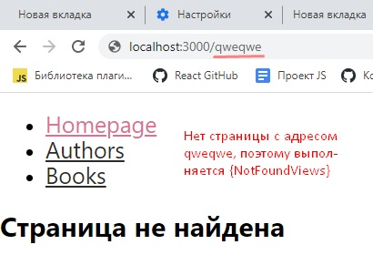

# Инструкция по работе с React Router

## Содержание:

[Start](#start)

[CreateNavigation](#createnavigation)

[NavLink](#navlink) + [Example](#example)

[Switch](#switch)

[Workshow](#workshop)

---

### Start

1. Установить пакет
   [react-router-dom](https://reactrouter.com/web/guides/quick-start)
2. В корневом index.js сделать import{BrowserRouter} from 'react-router-dom' и
   обернуть компонент App в BrowserRouter:

   ```
   <BrowserRouter>
   <App />
   </BrowserRouter>
   ```

3. Создать в папке src папку views для компонентов-страниц, которые будут
   рендериться

4. В App сделать `import {Route} from 'react-router-dom'`, прописать этот
   компонент в App и задать ему несколько пропов:

   - path - принимает путь к странице
   - component - принимает компонент, который надо зарендерить

   - exact - булевый проп, передается без значения (по умолчанию - **true**) для
     рендеринга только при точном совпадении, позволяет избежать одновременного
     рендера 2-х и более страниц, которые начинаются на одни и те же символы.
     Например '/' '/product', '/products'

#### Example

1. Создаем компонент домашней страницы HomeView.
2. Делаем import в App.
3. Пишем в App `<Route path="/" component={HomeView}` />
   `<Route path="/newpage" component={NewPage} `/>

---

### CreateNavigation

**Навигация делается не как ссылки на страницы,** т.к. при клике на ссылку
происходит перезагрузка страницы. Для создания навигации без перезагрузки
страницы нужно **просто изменить URL в адресной строке.** Для этого:

1. Делаем в App `import {Link} from 'react-router-dom'` - аналог тега `<a>` с
   расширенным функционалом (изменяет url при клике без перезагрузки)
2. Добавляем компонент `{Link}`в App с пропсами:
   - to - значение - строка адреса, куда надо перенаправить (относительно корня)

Пример:


---

### Компонент NavLink

Для добавления стилизации вместо {Link} можно использовать {NavLink}, у которого
есть доп. пропы:

1. `style={основные стили}`
2. `activeStyle={стили в активном состоянии}`

Так как мы **НЕ** используем инлайн-стили, то меняем _~~style~~_ на
**_className_**, а _~~activeStyle~~_ на **activeClassName**.

В итоге получаем:

```
         <NavLink to="/" className="NavLink" activeClassName="NavLink__active">
            Homepage
         </NavLink>
```

При передаче activeClassName на несколько страниц сразу стили автоматически не
переключаются при клике на др. компонент, он становится активным в придачу к
изначально активному компоненту, так как они имеют общий корень - **`/`**, а
сравнение идет по принципу _"начинается на..."_

---


---

Избежать этого помогает добавление булевого пропа **`exact`**. В этом случае
**`activeClassName`** применится только к той ссылке, у которой значение пропа
**`to === path`**

---


---

### Компонент Switch

**Если в навигации нет адреса, введенного в url-строку, ничего не
зарендерится.** Для обработки запросов по несуществующему адресу:

1. Создаем компонент NotFoundView для обработки запросов по несуществующим
   адресам
2. Добавляем в App {Route component={NotFoundView}}
3. Проп path не указан, поэтому NotFoundView рендерится всегда. Чтобы это
   поправить, нужен компонент Switch из react-router-dom

   `import { Switch } from 'react-router-dom'`

4. Оборачиваем в него группу `<Route/>`.

```
      <Switch>
        <Route exact path="/" component={HomeView} />
        <Route path="/authors" component={AuthorsView} />
        <Route path="/books" component={BooksView} />
        <Route component={NotFoundViews} />
      </Switch>
```



`{Switch}` проходится по группе `<Route/>` до 1-го совпадения, игнорируя
остальные. Так как компонент `{NotFoundViews}` записан в последний `<Route/>`,
**он выполнится только в том случае, если не выполнится ни один из предыдущих,
т.е. тогда, когда поступит запрос на несуществующий адрес**.

---

### Workshop

1. Используем [Json Server](https://www.npmjs.com/package/json-server) для
   имитации бекенда.

   - В объекте scripts файла package.json
     прописать`"api-server": "json-server --delay 300 --port 4040 --watch db.json"`
     - создать `db.json` в корне проекта.

- запусить json-server командой `npm run api-server`

2. Добавляем данные в `db.json`
   [из репозитория Репеты](https://github.com/luxplanjay/react-18/blob/07-react-router/db.json).
3. Создаем компонент BooksView со стейтом
4. Получаем список объектов книг через then или axios
5. Выводим заголовки книг


